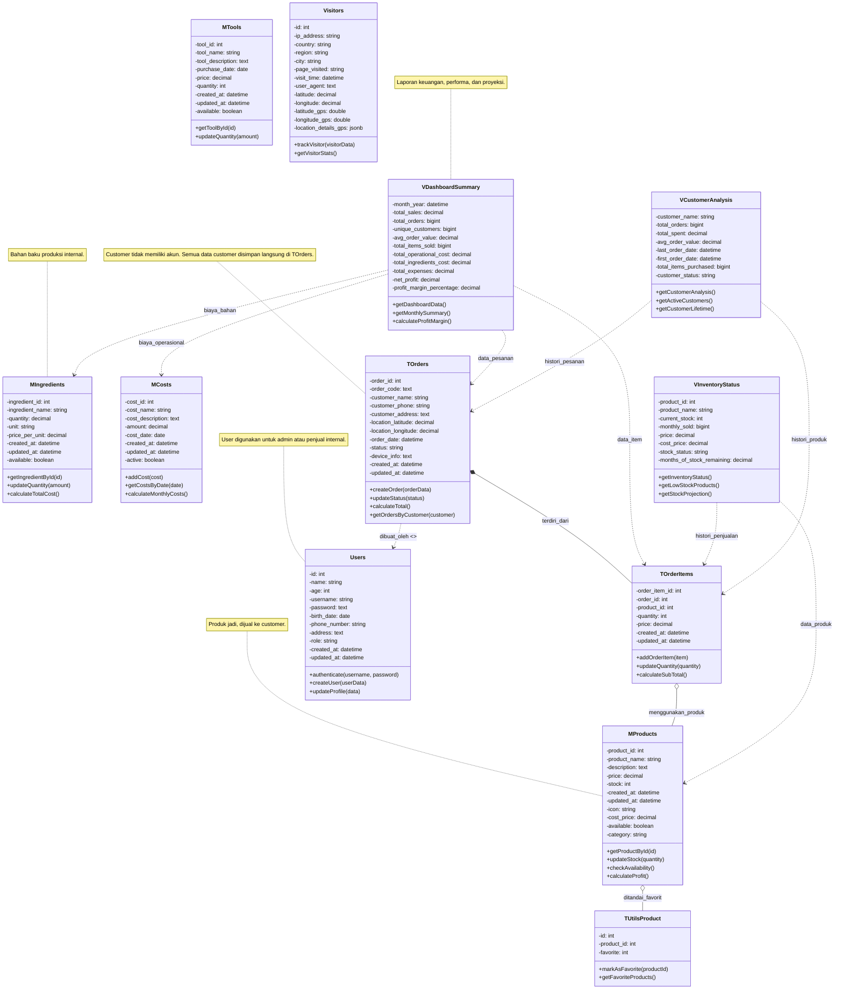

```mermaid
classDiagram

%% === MASTER DATA ===
class MProducts {
    -product_id: int
    -product_name: string
    -description: text
    -price: decimal
    -stock: int
    -created_at: datetime
    -updated_at: datetime
    -icon: string
    -cost_price: decimal
    -available: boolean
    -category: string
    +getProductById(id)
    +updateStock(quantity)
    +checkAvailability()
    +calculateProfit()
}

class MIngredients {
    -ingredient_id: int
    -ingredient_name: string
    -quantity: decimal
    -unit: string
    -price_per_unit: decimal
    -created_at: datetime
    -updated_at: datetime
    -available: boolean
    +getIngredientById(id)
    +updateQuantity(amount)
    +calculateTotalCost()
}

class MCosts {
    -cost_id: int
    -cost_name: string
    -cost_description: text
    -amount: decimal
    -cost_date: date
    -created_at: datetime
    -updated_at: datetime
    -active: boolean
    +addCost(cost)
    +getCostsByDate(date)
    +calculateMonthlyCosts()
}

class MTools {
    -tool_id: int
    -tool_name: string
    -tool_description: text
    -purchase_date: date
    -price: decimal
    -quantity: int
    -created_at: datetime
    -updated_at: datetime
    -available: boolean
    +getToolById(id)
    +updateQuantity(amount)
}

%% === TRANSAKSI ===
class TOrders {
    -order_id: int
    -order_code: text
    -customer_name: string
    -customer_phone: string
    -customer_address: text
    -location_latitude: decimal
    -location_longitude: decimal
    -order_date: datetime
    -status: string
    -device_info: text
    -created_at: datetime
    -updated_at: datetime
    +createOrder(orderData)
    +updateStatus(status)
    +calculateTotal()
    +getOrdersByCustomer(customer)
}

class TOrderItems {
    -order_item_id: int
    -order_id: int
    -product_id: int
    -quantity: int
    -price: decimal
    -created_at: datetime
    -updated_at: datetime
    +addOrderItem(item)
    +updateQuantity(quantity)
    +calculateSubTotal()
}

%% === UTILITY ===
class TUtilsProduct {
    -id: int
    -product_id: int
    -favorite: int
    +markAsFavorite(productId)
    +getFavoriteProducts()
}

class Users {
    -id: int
    -name: string
    -age: int
    -username: string
    -password: text
    -birth_date: date
    -phone_number: string
    -address: text
    -role: string
    -created_at: datetime
    -updated_at: datetime
    +authenticate(username, password)
    +createUser(userData)
    +updateProfile(data)
}

class Visitors {
    -id: int
    -ip_address: string
    -country: string
    -region: string
    -city: string
    -page_visited: string
    -visit_time: datetime
    -user_agent: text
    -latitude: decimal
    -longitude: decimal
    -latitude_gps: double
    -longitude_gps: double
    -location_details_gps: jsonb
    +trackVisitor(visitorData)
    +getVisitorStats()
}

%% === VIEW / ANALYTICS ===
class VCustomerAnalysis {
    -customer_name: string
    -total_orders: bigint
    -total_spent: decimal
    -avg_order_value: decimal
    -last_order_date: datetime
    -first_order_date: datetime
    -total_items_purchased: bigint
    -customer_status: string
    +getCustomerAnalysis()
    +getActiveCustomers()
    +getCustomerLifetime()
}

class VInventoryStatus {
    -product_id: int
    -product_name: string
    -current_stock: int
    -monthly_sold: bigint
    -price: decimal
    -cost_price: decimal
    -stock_status: string
    -months_of_stock_remaining: decimal
    +getInventoryStatus()
    +getLowStockProducts()
    +getStockProjection()
}

class VDashboardSummary {
    -month_year: datetime
    -total_sales: decimal
    -total_orders: bigint
    -unique_customers: bigint
    -avg_order_value: decimal
    -total_items_sold: bigint
    -total_operational_cost: decimal
    -total_ingredients_cost: decimal
    -total_expenses: decimal
    -net_profit: decimal
    -profit_margin_percentage: decimal
    +getDashboardData()
    +getMonthlySummary()
    +calculateProfitMargin()
}

%% === RELASI ===

TOrders *-- TOrderItems : terdiri_dari
TOrderItems o-- MProducts : menggunakan_produk
MProducts o-- TUtilsProduct : ditandai_favorit
TOrders ..> Users : dibuat_oleh <<khusus penjual>>

VDashboardSummary ..> TOrders : data_pesanan
VDashboardSummary ..> TOrderItems : data_item
VDashboardSummary ..> MCosts : biaya_operasional
VDashboardSummary ..> MIngredients : biaya_bahan

VInventoryStatus ..> MProducts : data_produk
VInventoryStatus ..> TOrderItems : histori_penjualan

VCustomerAnalysis ..> TOrders : histori_pesanan
VCustomerAnalysis ..> TOrderItems : histori_produk

%% === CATATAN ===
note for TOrders "Customer tidak memiliki akun. Semua data customer disimpan langsung di TOrders."
note for Users "User digunakan untuk admin atau penjual internal."
note for MProducts "Produk jadi, dijual ke customer."
note for MIngredients "Bahan baku produksi internal."
note for VDashboardSummary "Laporan keuangan, performa, dan proyeksi."

```
