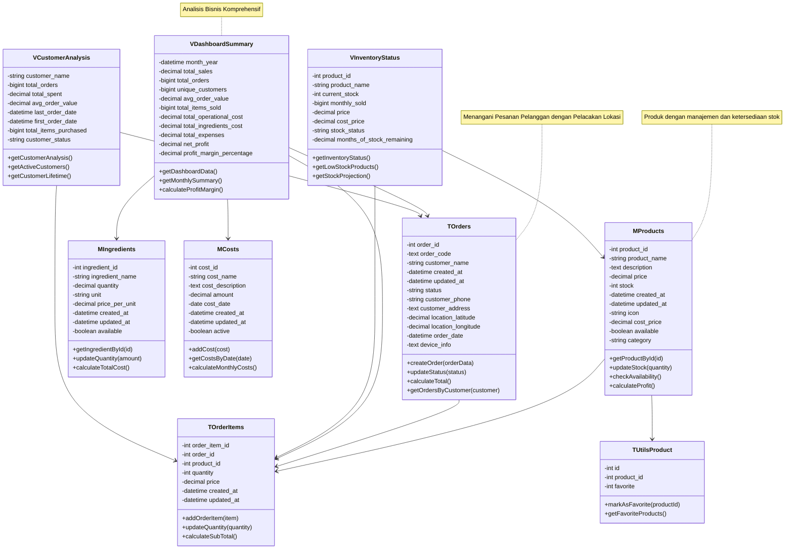

```mermaid
classDiagram
    %% Master Data Classes
    class MProducts {
        -int product_id
        -string product_name
        -text description
        -decimal price
        -int stock
        -datetime created_at
        -datetime updated_at
        -string icon
        -decimal cost_price
        -boolean available
        -string category
        +getProductById(id)
        +updateStock(quantity)
        +checkAvailability()
        +calculateProfit()
    }

    class MIngredients {
        -int ingredient_id
        -string ingredient_name
        -decimal quantity
        -string unit
        -decimal price_per_unit
        -datetime created_at
        -datetime updated_at
        -boolean available
        +getIngredientById(id)
        +updateQuantity(amount)
        +calculateTotalCost()
    }

    class MCosts {
        -int cost_id
        -string cost_name
        -text cost_description
        -decimal amount
        -date cost_date
        -datetime created_at
        -datetime updated_at
        -boolean active
        +addCost(cost)
        +getCostsByDate(date)
        +calculateMonthlyCosts()
    }

    %% Transaction Classes
    class TOrders {
        -int order_id
        -text order_code
        -string customer_name
        -datetime created_at
        -datetime updated_at
        -string status
        -string customer_phone
        -text customer_address
        -decimal location_latitude
        -decimal location_longitude
        -datetime order_date
        -text device_info
        +createOrder(orderData)
        +updateStatus(status)
        +calculateTotal()
        +getOrdersByCustomer(customer)
    }

    class TOrderItems {
        -int order_item_id
        -int order_id
        -int product_id
        -int quantity
        -decimal price
        -datetime created_at
        -datetime updated_at
        +addOrderItem(item)
        +updateQuantity(quantity)
        +calculateSubTotal()
    }

    %% Utility Classes
    class TUtilsProduct {
        -int id
        -int product_id
        -int favorite
        +markAsFavorite(productId)
        +getFavoriteProducts()
    }

    %% View Classes (Business Logic)
    class VCustomerAnalysis {
        -string customer_name
        -bigint total_orders
        -decimal total_spent
        -decimal avg_order_value
        -datetime last_order_date
        -datetime first_order_date
        -bigint total_items_purchased
        -string customer_status
        +getCustomerAnalysis()
        +getActiveCustomers()
        +getCustomerLifetime()
    }

    class VInventoryStatus {
        -int product_id
        -string product_name
        -int current_stock
        -bigint monthly_sold
        -decimal price
        -decimal cost_price
        -string stock_status
        -decimal months_of_stock_remaining
        +getInventoryStatus()
        +getLowStockProducts()
        +getStockProjection()
    }

    class VDashboardSummary {
        -datetime month_year
        -decimal total_sales
        -bigint total_orders
        -bigint unique_customers
        -decimal avg_order_value
        -bigint total_items_sold
        -decimal total_operational_cost
        -decimal total_ingredients_cost
        -decimal total_expenses
        -decimal net_profit
        -decimal profit_margin_percentage
        +getDashboardData()
        +getMonthlySummary()
        +calculateProfitMargin()
    }

    %% Relationships
    MProducts --> TOrderItems
    MProducts --> TUtilsProduct
    TOrders --> TOrderItems

    %% Dependencies
    VDashboardSummary --> MCosts
    VDashboardSummary --> MIngredients
    VDashboardSummary --> TOrders
    VDashboardSummary --> TOrderItems
    VCustomerAnalysis --> TOrders
    VInventoryStatus --> TOrderItems
    VCustomerAnalysis --> TOrderItems
    VInventoryStatus --> MProducts

    %% Notes
    note for TOrders "Menangani Pesanan Pelanggan dengan Pelacakan Lokasi"
    note for MProducts "Produk dengan manajemen dan ketersediaan stok"
    note for VDashboardSummary "Analisis Bisnis Komprehensif"
```
